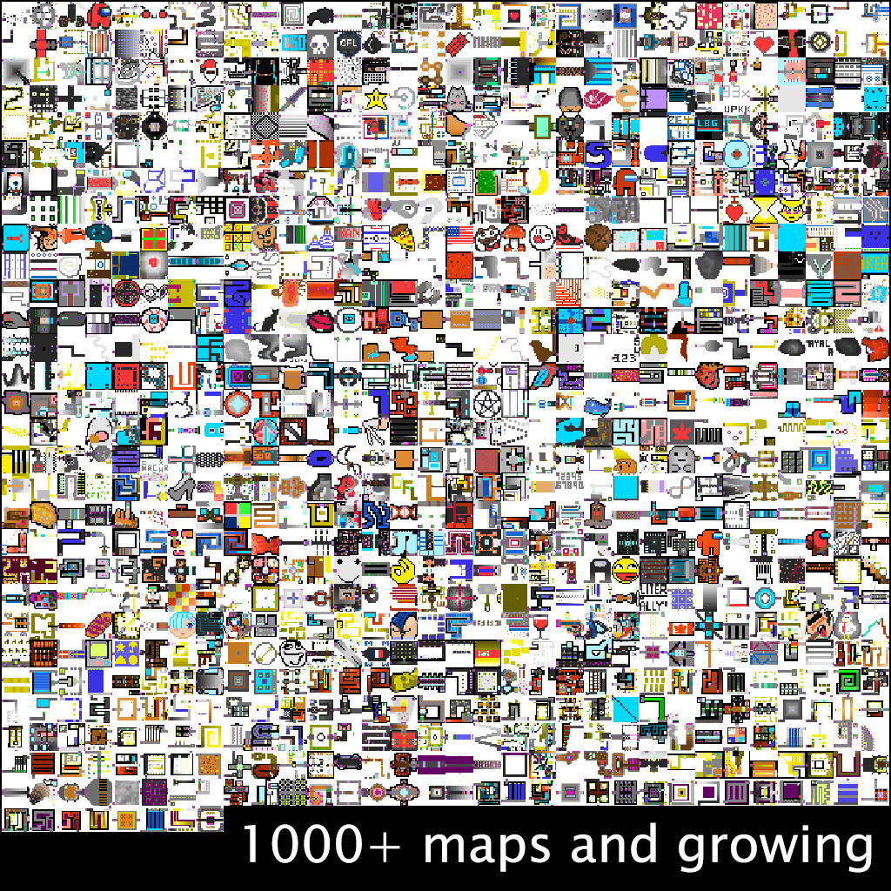
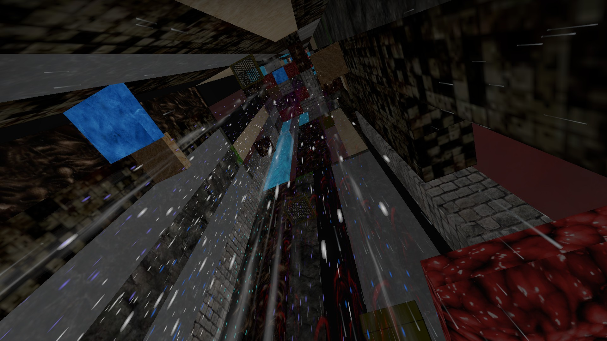
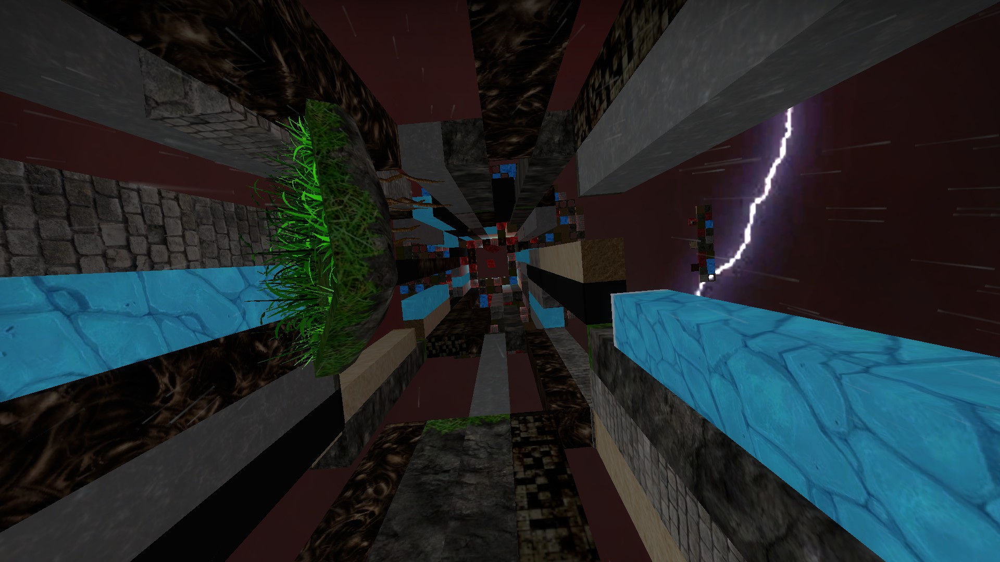
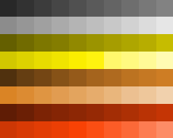
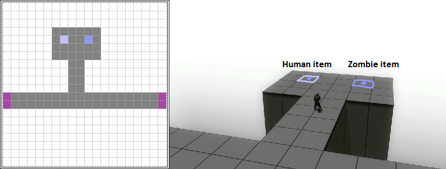
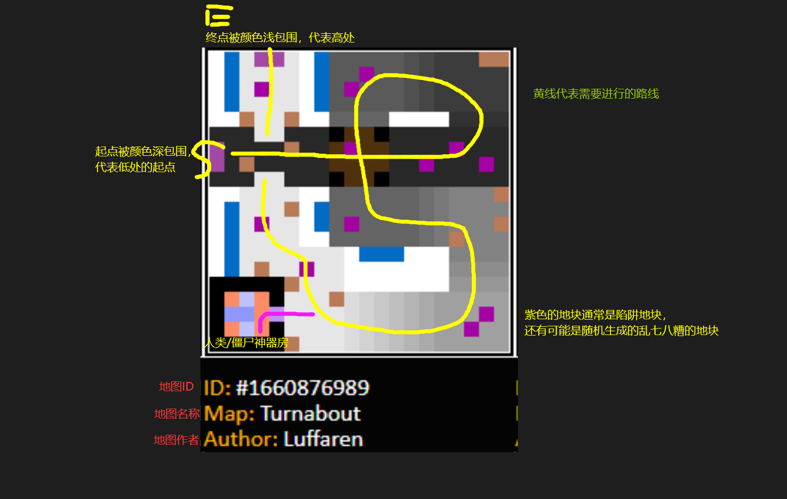

# CS:GO 僵尸逃跑地图 ze_collective 游玩指南 Part.1

Map core by [Luffaren](https://steamcommunity.com/id/LuffarenPer) (STEAM_1:1:22521282)  
This guide by [NyaaaDoge](https://steamcommunity.com/id/NyaaaDoge/) (STEAM_1:1:59449830)

----

## 1. 目录索引  

- [CS:GO 僵尸逃跑地图 ze\_collective 游玩指南 Part.1](#csgo-僵尸逃跑地图-ze_collective-游玩指南-part1)
  - [1. 目录索引](#1-目录索引)
  - [2. 前言](#2-前言)
  - [3. 地图基本说明](#3-地图基本说明)
    - [3.1 地图基本流程](#31-地图基本流程)
    - [3.2 关卡说明](#32-关卡说明)
      - [3.2.1 关卡难度](#321-关卡难度)
  - [4. 关卡结局](#4-关卡结局)
  - [5. 认识小地图中的基本色块](#5-认识小地图中的基本色块)
    - [5.1 起始与终点地块](#51-起始与终点地块)
    - [5.2 道路和地板色块](#52-道路和地板色块)
    - [5.3 物品色块](#53-物品色块)
    - [5.4 陷阱色块](#54-陷阱色块)
    - [5.5 其他常见的色块](#55-其他常见的色块)
    - [5.6 简单总结](#56-简单总结)
  - [前往 Part.2 第二部分了解更多内容](#前往-part2-第二部分了解更多内容)

----

## 2. 前言

  
CS:GO 僵尸逃跑[^僵尸逃跑模式]地图 ze_collective 是 Luffaren 创作地图内核、玩家创造大部分主要关卡的一张近似于随机生成的僵尸逃跑地图。你可以简单理解为ze中的 *Roguelike* 模式，地图流程都是基于随机生成的关卡进行的。此指南旨在介绍 ze_collective[^ze_collective] 的部分内容，便于玩家在地图中获得更好的游戏体验，同时激发有想法的玩家去使用[ze_collective关卡创作工具](http://www.luffaren.com/misc/PixelPaint/pixel-paint-master/index.php)去创造自己心目中的关卡。本指南目前只有一个人编写，如有错误请大胆指出，感激不尽，如果您认为需要补充或者改正，可以联系我或者发Issue，当然直接发PR也是可以的。  

  
**[前往Gamebanana下载该地图](https://gamebanana.com/mods/395733)**

[^僵尸逃跑模式]: 英文全称 Zombie Escape，主要的游玩方式就是人类需要使用尽可能多的手段阻止僵尸 感染/击破 人类，僵尸需要用各种方式阻止人类逃跑，包括但不限于 感染/击破 人类。人类躲避僵尸进行逃跑通常会有终点，一般情况下到达终点 躲避/消灭 所有僵尸即可获得游戏的胜利。
[^ze_collective]: 编写此指南的时候地图版本为 v1_9，其中的`数值`可能会根据版本不同而改变。

## 3. 地图基本说明

### 3.1 地图基本流程

人类需要通过由许多小关卡组成的大关卡并且完成相应的结局，僵尸则需要使用各种手段阻挠人类达成胜利，被选为“母体僵尸”也具有诸多优势，请先不要着急。
  
人类需要在80s内触发每一个小关卡的终点，如果在60s内没有触发完成会让僵尸启用无敌。每一个小关卡都会在屏幕下方以一张20x20的像素图片minimap的形式出现，里面通常可以读出很多的地图信息，如果您是地图指挥建议请不要忽视该信息。如果想知道每个色块对应的东西可以前往[Luffaren的网站](http://luffaren.com/ze_collective.php)查阅相关信息[^查阅相关信息]。
  
每一大关都是由几个不同的小关卡和一个结局关卡(部分结局可能没有新生成关卡)组成的大关卡，
通常情况下会同时存在3个小关卡，最前面的关卡触发了，最后的关卡会在特定时间内逐渐消失（消失时间固定5s）。具体时间看是第几大关。在生成下一张地图的时候，会将上一张地图的开关、障碍物全部清除。  
通关普通Finale之后会开启无限模式(Infinite mode)[^开启无限模式]，你可以以通关为目标，也可以以游玩尽可能多的关卡为目标，总之，一切取决于玩家怎么想。

这张地图中的小关卡数不胜数并且会一直保持增长，也许其中会有你认识的人甚至是你自己创造的关卡呢？！  
  
  
[^查阅相关信息]: 绘画工具和每个色块说明请在[此处查阅](http://www.luffaren.com/misc/PixelPaint/pixel-paint-master/index.php)
[^开启无限模式]: 出生点上方就是调关房，noclip上去按按钮即可。
  
### 3.2 关卡说明

| 大关卡 | 小关卡（pixel-stages）数   | 说明 | 变黑圈到开始逐渐消失时间 |
| ---- | ---- | ---- | ---- |
| Level 1 | 5 (+1) stages | 可能+1结局关 | 关卡变黑圈5s开始逐渐消失(5s+5s)  |
| Level 2 | 6 (+1) stages | 可能+1结局关 | 关卡变黑圈8s开始逐渐消失(8s+5s)  |
| Level 3 | 7 (+1) stages | 可能+1结局关 | 关卡变黑圈10s开始逐渐消失(10s+5s) |
| Level 4 | 8 (+1) stages | 可能+1结局关 | 关卡变黑圈15s开始逐渐消失(15s+5s) |
| Finale  | 10 +1 stages | 先进行BOSS战后10关逃亡路。最后是 1 关是金字塔守点（守40s）。 | 逃亡路关卡触发紫圈后3s最后的关卡快速消失 |
| Infinite mode | 想打多少打多少。10关后出现眼睛，人类射击其进行投票，通过后(70%)进入Boss战 | Boss之后的逃亡路有 10 + 当前地图池关卡的总数\*0.003（向下取整） stages（最多增加20关） | 普通关卡变黑圈10s开始逐渐消失(10s+5s)。逃亡路关卡触发紫圈后3s最后的关卡快速消失 |

#### 3.2.1 关卡难度

每一大关的难度都会有所不同，具体体现在每一大关的按钮触发时间、障碍物耐久、有害液体伤害、陷阱生成概率、事件刷新频率[^事件刷新频率]等。

| 关卡 | 事件刷新保底概率(%) | 未触发事件增加概率(%) | 事件CD最大值(levels) | 延时门打开时间(sec) | 开关门打开用时(sec) | 障碍物耐久(倍) | 有害液体伤害 | 陷阱地块产生陷阱概率(%) | 初始ZM物品 |
|---|---|---|---|---|---|---|---|---|---|
| stage 1 | 15 | 5 | 5 | 2 | 0 | 0.5 | 4 | 20 | 2 |
| stage 2 | 20 | 5 | 4 | 4 | 2 | 0.75  | 9 | 40 | 3 |
| stage 3 | 25  | 5 | 3 | 6 | 4 | 1.0 | 14 | 60 | 4 |
| stage 4 | 30  | 10 | 3 | 8 | 6 | 1.5 | 19 | 80 | 5 |
| stage infinite| 15 | 5 | 5 | 5 | 0 | 0.8 | 9 | 30 | 5 |

由此可见 Infinite mode 的难度设置并不一定是最难的，无限关的难度方面相对设计的比较舒适，可以多多尝试玩玩各种各样有趣华丽的关卡。  
[^事件刷新频率]: 事件刷新机制请前往 [7. 地图事件](ze_collective%20guide%20pt2.md) 一节查看。

**Boss战**

Boss拥有基础血量3000，普通Finale每个人类增加血量17000。无限Finale每个人类增加20000，无限Finale也会根据地图池的关卡总数计算Boss血量，每个关卡增加30，以关卡增加血量的方式最多增加100000。每个人类在Boss战中阵亡会减少Boss 8000的血量。一颗雷对Boss造成2500伤害同时有30%几率击晕Boss 2s。
Boss直接触碰人类造成高额伤害，Boss有如下技能：

- 直视人类的时候可能会发射蓝色光波将人类往Boss方向吸引，此时被吸引人可以不用看向Boss，躲避技能。
- 用他的尾巴敲打人类
- 拆除Boss战平台脚下的方块用来砸人
- Boss停止移动，前摇散发黄色光波，释放推力将人类往外平台外推，人类视野里面没有Boss可以不被推力影响，往平台外看。
- Boss到场地中央甩他的尾巴，人类跳低刀来躲避

| 关卡 | Boss数量（最多5只） | Boss血量 | Boss最大眩晕时间 |
| ---- | ---- | ---- | ---- |
| Finale | 1 只 | 3000 + CT人数*17000 + 当前地图池关卡的总数\*30（关卡增加的血量最多100000） | 20s |
| Infinite Finale | 2 + 当前地图池关卡的总数\*0.0004（向下取整） | 3000 + CT人数\*20000 + 当前地图池关卡的总数\*30（关卡增加的血量最多100000） | 10s |

人类也会根据地图池关卡的总数增加对应的伤害倍率。  
人类对Boss的伤害倍率 = 1.00(无限关为 1.50) + 当前地图池关卡的总数\*0.0001（最多增加2.0）  

> 关于Finale：生成需要差不多20s到电梯门口，15s电梯门开（4s开完），15s电梯门关（4s延迟门），再过15s电梯门开。人类需要进入低重力区域，寻找各种平台往高处飞一直到最顶端的电梯上乘坐电梯，可以一格一格跳，也可以一次跳两格。电梯往上升到Boss战平台。

> 等电梯上升后抬头躲避天坠碎片，碎片会对人类造成伤害。电梯到顶10s后Boss苏醒且可被攻击，进入Boss战。普通Finale Boss打完Boss大概18s落地到第一个stage进行Finale Endrun。  
> 普通Finale Endrun会关闭各种陷阱地块陷阱的刷新，通常Endrun不会刷新大部分可交互元素，专心寻找逃亡路即可。逃亡路会一直有天坠掉落方块碎片，并且摔下虚空直接死亡，没有假摔机会。 一直到最后金字塔守40s，神风飞机的触发延迟时间是15s（出现"YOU REACHED THE END"文本后）。玩家到达金字塔电梯后会有延迟15s刷新神风飞机。电梯上升，僵尸死亡，人类胜利。  
>
> 关于Infinite模式下的Finale：Boss电梯上升的天坠伤害增加。逃亡路每一个stage都会刷zm神器，并且无限Finale Endrun会启用陷阱地块的陷阱刷新，同时固定每隔25s到50s之间随机选母体僵尸刷出神风飞机。同时也会刷其他事件。

## 4. 关卡结局

| 结局 | 说明 | 备注 |
| ---- | ---- | ---- |
| RISE | 往高处走守住最后的平台 | 路上的地板会分崩离析 |
| CLIMB | 往上爬守住最后的高台死守100s | 8.8s后跳板开放，结局35s后会有天坠，113s后高塔逐渐崩塌。结局36s后会无限刷新僵尸flight物品（固定5个），140s后处死所有僵尸flight |
| BUNKER | 守住最后的地堡90s直至没有僵尸剩余 | 60s后前面的关卡会全部消失。地结局堡垒的墙壁不会被毁灭大锤锤。僵尸进入地堡会变成1000hp，如果在外面全部坍塌40s后没能消灭僵尸将会全体处死 |
| BRIDGE | 结局守住最后的桥45s | 28s后前面的关卡全部消失 |
| ASCEND | 需要守住自己的地形60s后等待起飞，起飞12s后处死僵尸胜利 | 最后需要一块没有顶头的区域起飞到顶端。9s后会刷僵尸flight和僵尸moonboost|
| CONFLIT | 斯巴达结局人类守旗60s，僵尸占旗进度需要100% | 高跳需要按蹲之后再跳才能跳得高（可以蹲着跳）。战场上会刷各种物品。僵尸碰到人类会造成伤害，僵尸基础血量100，每个人类增加180hp |
| HUNT | 人类有65s的时间去猎杀僵尸 | 人类tp回起点只有在开头的5s有防抓免疫。僵尸基础血量150hp，每个人类增加25hp |
| RACE | 结局人类坐上卡丁车存活120s或者等到僵尸全部死掉 | 卡丁车操作是往水平方向向上看是加速，垂直水平方向看是正常速度，往下看是减速。（在非卡丁车结局中可以视角往最下面看下车，但是RACE结局锁了这个功能，同理非RACE结局情况下可以往最头上看跳跃）。天上会掉方块碎片，每块造成29点伤害。僵尸卡丁车碰到人类后会自爆。 |

## 5. 认识小地图中的基本色块

### 5.1 起始与终点地块

哥们随便抽一张minimap，你能读出其中的关键信息吗？  
  
它放到游戏里面是这样的  
  

那么我们看到小地图信息应该怎么办呢？首先你需要了解 开始/结束 颜色地块。
它的颜色是这样的，有了他你才能知道哪里是关卡的起点与终点。需要提及的一点就是，起点色块永远并且一定是在小地图的最左侧，你对小地图的阅读顺序应该是从左往右寻找给断后部队撤退的那条路。贴门触发玩家应该寻找触发终点的那条路，同时建议触发者触发终点前观察大部分玩家所在的位置和情况，贸然触发终点容易导致人类受到损失。  
如果关卡设置了结束按钮，指示终点的圈会从默认的紫色（触碰即可触发终点）变成红色（需要按下所有紫色的按钮才能触发终点）    
按下所有的这些紫色的按钮即可触发终点  

### 5.2 道路和地板色块

  
这些色块构成了绝大部分地图的路和地板。颜色越浅代表高度越高，同理越深越暗代表高度越低。白色代表普通地板，黄色代表平台地板，褐色代表普通地板上面有天花板（天花板其实可以当做平台地板行走），红色代表普通地板头上是超高的墙壁。  

### 5.3 物品色块

如想查看物品列表请查看 [8. 地图物品](ze_collective%20guide%20pt2.md) 一节。  
人类神器物品刷新的色块  
僵尸神器物品刷新的色块  

### 5.4 陷阱色块

最后是陷阱刷新的色块  
陷阱列表可以前往 [9. 陷阱地块](ze_collective%20guide%20pt2.md) 一节查看。

### 5.5 其他常见的色块  

这些色块大部分的小地图都有使用到，同样是比较常见的色块。

1. 开关门色块  
普通的开关门是绿色的色块。
前面两个色块分别是HOLD 1（门）、BUTTON 1（按钮）。后面的色块就是HOLD 2、BUTTON 2。以此类推，一共有4个开关门色块，只有按下所有对应的按钮才能开启这个开关门。  

还有一种色块就是逆转开关门色块。这些色块只有在按下了所有对应的按钮之后才会升起/关闭，平常状态下是开启/降下的。  

2. 传送入口与传送终点色块  
与开个关门色块类似，前面两个色块分别是TELEPORT 1（传送门入口）、TELEPORTDES 1（传送终点）。后面依次类推，一共有4个传送入口色块。  
需要注意的是，玩家有超过400的下降速度(从~+5的高度或以上跳落到传送门上)，它会让玩家在终点做一次同样速度的弹射，弹跳继承将玩家当前的下落速度，并使玩家向上弹射，这可以让玩家进行一些有想象力/有趣的关卡(如果没有终点则会在本身的这个入口进行弹跳，相当于蹦床)。你可以理解成V社游戏[《传送门》](https://store.steampowered.com/app/400/Portal/)系列那样的入门和出门机制。
  

3. 障碍物与倒计时开关门色块  
这两个色块通常用于阻碍/拖延玩家在关卡内的行进。

    - 障碍物色块  
射击可摧毁的障碍物（高5个高度）被击中/损坏，直到其破坏（计算命中数，而不是实际伤害）  
障碍物耐久值(hits) = 5 + 障碍物耐久倍率*当前服务器玩家总数  
  
    - 倒计时开关门色块  
按使用键 `E` 来触发这个门（高5个高度）。一旦触发后，它将X秒（X可能因某些情况而异，如当前主题等）后打开，和开关门类似。  
  

4. 攀岩色块  
攀岩色块分为两种，一种是简单的跳跃就能攀爬的台阶，还有一种需要一点技巧才能攀岩的小落脚点。通常用于协助玩家越过有高度差的地形。  

5. 弹跳跳板色块  
有上下左右和垂直方向5种跳板。
垂直跳板将玩家垂直方向弹射，触碰将会将垂直向上的速度设置为700，如果水平方向有速度则会保持水平方向上的速度弹射（速度大于400限制为400）。
上下左右方向会将玩家按照跳板设置的方向以500的速度弹射，垂直向上的速度设置为520。  

如果想了解更多颜色代表的各种地块，请查阅Luff提供的[绘画工具](http://www.luffaren.com/misc/PixelPaint/pixel-paint-master/index.php)里面的文档说明。

### 5.6 简单总结

通过了解这些基本的色块，现在我们可以读出部分地图信息。以刚才的Turnabout关卡举例，我们可以读出很多的信息：  
  
如果不能第一时间读出小地图的各种信息也不用太过担心，Luff在其绘画文档里面曾阐述给作者
> 在现场实际游玩关卡之前，人类很难确切地知道关卡里面的某件事情会有多困难，需要作者作图之前三思/使之合理  

ze_collective的关卡通常情况下都是不会太过于困难的，其核心理念不太提倡接受太过于困难的关卡。毕竟不是人人都是身法高手，玩家在绝大部分情况下对于游玩的关卡都是一种初见的状态，很少有人能够一下子读完认识完一张地图的所有内容。  

## 前往 Part.2 第二部分了解更多内容  

第二部分主要介绍地图的一些机制和各种物品以及部分内容。[点击前往查看](ze_collective%20guide%20pt2.md)。
