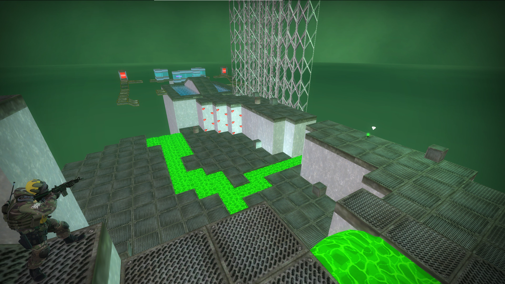
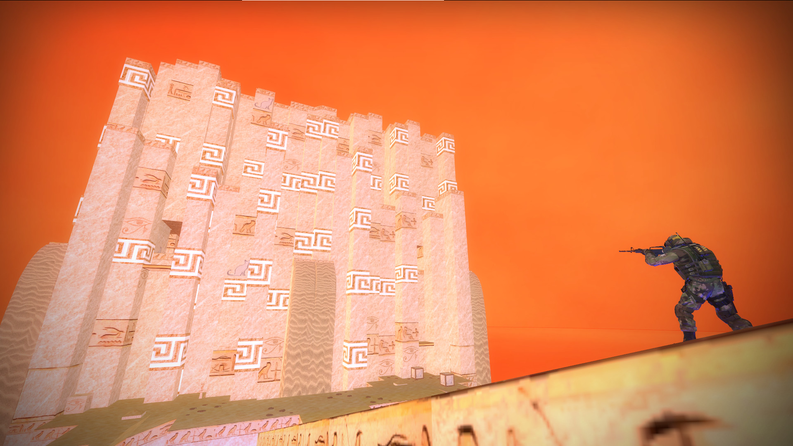
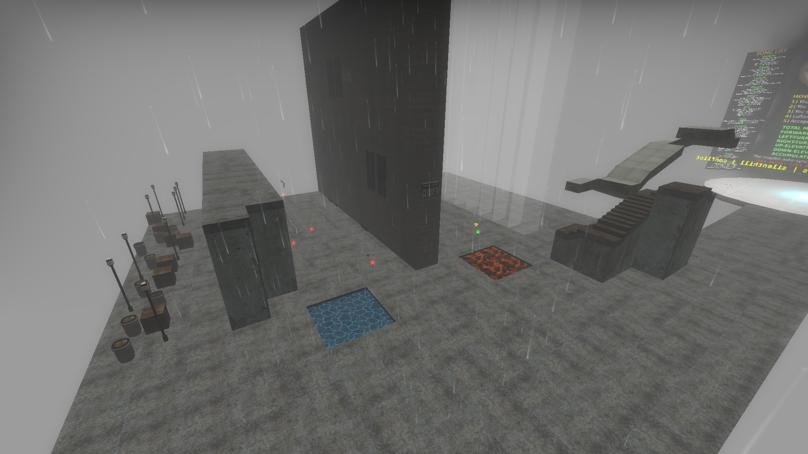
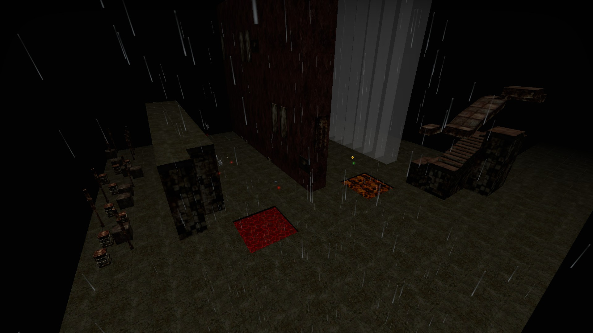
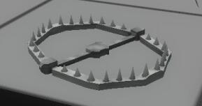

# CS:GO 僵尸逃跑地图 ze_collective 游玩指南 Part.2

Map core by [Luffaren](https://steamcommunity.com/id/LuffarenPer) (STEAM_1:1:22521282)  
This guide by [NyaaaDoge](https://steamcommunity.com/id/NyaaaDoge/) (STEAM_1:1:59449830)

----

- [CS:GO 僵尸逃跑地图 ze\_collective 游玩指南 Part.2](#csgo-僵尸逃跑地图-ze_collective-游玩指南-part2)
  - [6. 关卡主题](#6-关卡主题)
  - [7. 地图事件](#7-地图事件)
    - [7.1 事件刷新机制](#71-事件刷新机制)
    - [7.2 事件列表](#72-事件列表)
  - [8. 地图物品](#8-地图物品)
    - [8.1 (未翻译)人类物品 HUMAN](#81-未翻译人类物品-human)
    - [8.2 (未翻译)僵尸物品 ZOMBIE](#82-未翻译僵尸物品-zombie)
  - [9. 陷阱地块](#9-陷阱地块)
    - [9.1 Traps spawn](#91-traps-spawn)
    - [9.2 Traps vicinity](#92-traps-vicinity)
    - [9.3 Traps step](#93-traps-step)
  - [10. 一些小彩蛋](#10-一些小彩蛋)
  - [11. 写在最后](#11-写在最后)

----

上一部分我们了解了地图基本的构成，这部分我们来认识一下地图里面的各种内容。

## 6. 关卡主题

ze_collective设置了9种主题。不同的主题会有不同的难度和外貌。体现在关卡装饰物、液体以及墙壁道路等方面。

- generic  
  
原生主题的有害液体（岩浆）触碰后会伴随有持续性的灼烧伤害。
- castle  
  
城堡主题的有害液体（岩浆）触碰后会伴随有持续性的灼烧伤害。  
- factory  
  
- temple  
  
- nature  
  
- hell  
  
地狱主题的有害液体（岩浆）触碰后会伴随有持续性的灼烧伤害。  
- frost  
  
- silenthill  

表世界  
  
里世界，进入里世界主题时会有伴随有警报音，警报音一响起则预示着切换至里世界主题，此时人类触碰有害液体将会变成1hp，同时可视范围也会有所缩短。  

Finale的主题是混乱的，它糅合了所有的主题。
无限关的主题会随关卡的进行而改变。

## 7. 地图事件

在 Finale 中只有贴门炸弹和人类低重力事件不会刷，其他事件均可发生。

### 7.1 事件刷新机制  

通常情况下地图事件只会在生成下一个关卡的时候产生。

一般事件由一个保底的基础概率（通常15%，具体事件刷新概率请查看 [3.2.1 关卡难度](ze_collective%20guide%20pt1.md) 一节。）和累加概率共同决定（通常是5%），如果一个关卡内没有刷事件，则会往概率上累加概率值。  
事件发生之后会有一个 事件CD ，这个 事件CD 值会在0~5之间随机生成，同时每通过一个关卡之后会让事件CD-1直至归零。

举个例子，比如玩家在stage 4，stage 4的事件刷新保底概率是30%，我在开头生成的第一个小关卡没有产生事件，则会往这个概率上面累加10%，从而在生成下一个关卡的时候会有40%的概率随机产生一个事件，事件也有其他因素影响比如关卡的性能开销等。然后如果在下一个关卡没有产生事件，还是继续往这个概率栈里面累加10%，这时再生成下一个关卡产生事件的概率将会变成50%，一直到有事件发生为止。事件发生后，会产生相应的事件CD（stage4为0~3个关卡），在这个事件CD内产生的关卡通常情况下都不会再产生新的事件，并且每通过一个关卡让这个事件CD-1直到其变为0。  
*可以简单理解为现在大部分游戏的抽卡机制*

### 7.2 事件列表  

- **PIZZA OF DOOM**  
  
披萨从天而降，开枪或被毁灭。
基本血量500，每个人类增加1000血。
- **PLEDGE**  
  
我宣誓为collective尽一份力！  
`i pledge to do my part for the collective`  
在聊天框输入这段话即可。未宣誓者将每秒流失2hp直到去世。  
未宣誓者之死  
*`NyaaaDoge did not state the pledge`*  
- **KAMIKAZE**  
   
将母体僵尸选为神风飞机的驾驶员以自爆的方式冲向人类，人类需要将其击坠或躲在掩体之后。初始血量250，每一个人类增加50血。
- **BEAMS**  
  
天坠激光会从人类头上坠落。钻空隙躲避，碰到直接秒杀。
- **WORLD EATER**  
  
天上有一张大脸，射爆他，不然他就一直看着你。吞噬世界。如果没打掉，他会一直跟着人类  
大脸初始血量1000，每个人类加500血，每个僵尸加250血
- **THICK FOG**  
  
人类的视野暂时受浓厚迷雾阻碍，持续40s。
- **BLOODLUST**  
渴血事件。人类很饥渴（每次掉2hp），需要射爆僵尸才能回血（每次射击僵尸回3hp），持续60s。
- **DEBRIS**  
  
天上掉下各种地图方块的碎片，每块造成19hp，持续60s
- **LOW GRAV**  
人类获得20s的低重力，20s后直接切换成正常重力，人类要小心最后不要摔死了。
- **COLLAPSE**  
  
之前的关卡在逐渐分崩离析，该关卡内的所有的方块都会坍塌。
- **PHASING**  
  
人类的眼睛进行相位转移，参透世界，地图方块变得透明。持续20s  
*小心行事*
- **SILENCE**  
人类全体静音15s。15s逐渐消失，15s完全静音，10s恢复至正常。
- **WEAPON JAM**  
武器卡壳9s，期间会不停上子弹。
- **WALLBREAK**  
  
触发事件时所有的墙壁格子会逐渐消失，不再恢复。
- **BIGNADES**  
  
人类手雷暂时获得增益40s，期间手雷变成大脸 ~~(和天降大脸一个模型VAUFF)~~ ，每颗雷对僵尸造成5000伤害，手雷伤害范围增大，也会有高击退效果。对Boss也能造成5000伤害，同时会有60%的几率眩晕Boss 5s。
- **DOORHUG BOMB**  
  
*贴门炸弹，断后最爱，1点2秒，谁敢贴门？*  
通常只会在下张地图生成的时候产生该事件，左下角提示出现1.2s后爆炸，贴近伤害很高。聪明的人贴门都会离终点光圈至少2格远以上，虽然还是会受到些许伤害，但没有那么致命。
*断后部队不要怕，死的都是贴门的*
- **DISTORT**  
  
人类全体获得扭曲视线，持续15s。  
*我瞎了*

## 8. 地图物品

大部分情况下物品都有使用次数和限制。详细请查看拾取后的说明。物品最多存在30个，如果超过该数量新的关卡不会产生新的物品。  
如果关卡里面没有安排 人类/僵尸 物品生成点，且物品刷新机制认为需要生成神器的时候人类或僵尸物品会在关卡的两个起点色块刷新。  

### 8.1 (未翻译)人类物品 HUMAN

- **dragonslayer(`0s`)**  
It was too big to be called a sword...  
Use it while falling to downslash  
Using it puts a strain on your body  
You cannot use it while too weak (`5hp`)  
Blood-buildup makes it heavier to wield  
WaterCrystal can wash the blood off  
FireCrystal can make it temporarily stronger  
- **baguette(`0s`)**  
Hold zombies back with wide swings  
The swings hurts+pushes zombies (and hurts itself)The baguette eventually breaks by too much damage  
(break-chance stacks by `0.10%` for each swing-hit)  
(break-chance stacks by `0.50%` for each swing-miss)  
A watercrystal can set the break-chance to `-15.00%`  
Can hurt/stun boss  
- **minislots(`1s`)**  
A portable slotmachine to gamble on-the-go  
Win chance: `5.00%`  
Lose: lose `7hp`  
Win: gain `42hp`  
- **billnye(`1x`)**  
Show nearby zombies a Bill Nye VHS  
Keep class distracted while you laze off  
Their attention gets drawn to the TV  
It lasts for `14s`  
Can stun boss  
*[Bill Nye The Science Guy - Theme](https://youtu.be/nDN7M0J3HXc?t=16)*  

- **peanutbutter(`5s|10x`)**  
Smear out a plane of peanut butter  
It slows zombies heavily for `6s` on-touch  
The smear lasts `15s`  
The same smear can't slow the same zombie twice  
The slowdown stacks  
Can hurt/stun boss on-spawn  
- **claymore(`10x`)**  
Plant claymores in front of you  
They blow up when zombies go in front  
They hurt, burn and stop zombies  
Can hurt/stun boss  
FireCrystal can stack-buff its damage  
- **piggyback(1 seat)**  
Allows a human to piggyback on you(they must press E on the saddle to get on/off)  
If you die/drop the knife, the player gets forced off  
The rider gets a jump/velocity-boost when getting off  
(allowing for a yoshi/boost-jump)Give someone a joyride!  
- **hackerman(`1x`)**  
Gain 10s of aim-hacking + infinite ammo  
Just keep firing and get kill after kill  
Nearby/targeted zombies become 1-hit  
Nearby zombies get wallhack-marked  
Can hurt/stun boss  
- **bhop_steroids(`30.00f`)**  
Inject yourself with steroids  
for automatic bunnyhopping!  
Limited/fuel-like usage  
Toggle it on/off with +use/E  
`2.00f` insta-drains on each activation  
You can clear a 4-tile gap from the edge  
*[=) i´m not phoon =)](https://youtu.be/SNvDUO42Hys?t=35)*  
- **planetcrystal(`1x`)**  
  1. EarthCrystal  
Spawns a wall just in front of you  
3 tiles wide, 2 tiles tall, stays up for `12s`  
Auto-breaks by certain human touches (anti-grief)  
Auto-breaks near main-teleport  
Can hurt/stun boss  
  2. FireCrystal  
Damage heavily + set zombies on fire for `10s`  
It also slows zombies slightly for `3s`  
The fire shoots out towards your front  
It also stops the zombie-velocity on-first-touch  
Can hurt/stun boss  
  3. WindCrystal  
Push zombies back with a single wind gust  
The wind shoots out towards your front  
It's active/stationary for `2s`  
Cancels z-gust projectiles  
Can hurt/stun boss  
  4. WaterCrystal  
Stop + slow zombies heavily for `10s`  
The water shoots out towards your front  
It deals no damage, only slowdown  
Can hurt/stun boss  
- **rift(`1x`)**  
Create a shortcut portal  
1st use: create entry portal (big)  
2nd use: create destination portal (small)  
Portal clears `100s` from 1st use / Z-touch  
Use it to help your defenders get back safely  
2nd use cannot be used over gaps  
- **storm blade(`150s`)**  
Freeze and weaken zombies with a dimension-breaking slice  
Z-hp gets reduced to `2%` of their current health  
It only freezes nearby zombies the first moment on-use  
Once the post-cut hp-cap hits, nearby z's gets slowed for `15s`  
Can hurt/stun boss  
*[I AM THE STORM THAT IS APPROACHING](https://www.youtube.com/watch?v=NOZONW-UK0w)*  
- **heal orb(`1x`)**  
Places out a healing orb  
It heals `9hp` every `0.50s`(up to `150hp`)  
The orb lasts for `15s`  
The orb provides infinite ammo  
The orb provides +1 nade (once)  
通常情况下如果奶球不存在会在下一个关卡刷出来，即使用完了拿在身上也会判定为奶球存在  
- **moonboost(`1s`)**  
Gives an upwards boost  
Combine it with jumping for extra height  

特殊物品 卡丁车：  
kart(CONTROL BY MOUSE ONLY):  
Look upwards/center-height to accelerate  
Look downwards to slow down  
Look sideways to turn [relative to kart-rotation]  
Look straight down to get off[Locked for RACE ending]  

### 8.2 (未翻译)僵尸物品 ZOMBIE

通常情况下僵尸物品都会有一个仅限母体僵尸获取的锁定时间，所以母体僵尸可以有更快拿到物品的权利。这个锁定时间在任意僵尸触碰时就会开始计算。  

- **squid(`1x`)**  
Throw a squid that inks on floor-impact  
It throws towards your look-direction  
It can also bounce on walls  
Blinds and slows nearby humans from the impact  
Inked humans (`10s`) can't use items  
- **pizzabaker(`10s|3x`)**  
Spawns a pizza-projectile in your look-direction  
It instakills humans on-touch  
It goes through walls  
- **fling(`1x`)**  
Flings humans away from you  
Push them off edges  
Or fling away their defenses  
- **bomb chuck(`10s|3x`)**  
Throw a bomb that blows up after `5s`  
It throws towards your look-direction  
Deals AOE/explosive damage  
- **roar(`1x`)**  
Push nearby zombies forward with a roar  
The push goes towards your side-look-direction  
Surprise the human defenses!  
It also heals you nearby zombies to `10000hp`  
- **greasy fingers(`1x`)**  
Makes nearby humans drop their held weapons(for `2 seconds`)  
You get one chance, use it wisely  
- **poise(`1x`)**  
Gives `1.50s` invincibility on-use  
Human items/bullets can't affect you  
Nearby humans also get frozen by fear briefly  
15x forward-moving illusion-copies spawn too  
Time it wisely, you only have one shot  
- **flight(`1x`)**  
Gives you wings to fly with until you die  
You get capped to `500hp`  
Humans you infect get TP'd back  
You TP back when too close to triggering current-stage end  
Fly by looking around and using WASD  
(you have slow momentum)  
- **gust(`10s|5x`)**  
Spawns a gust-projectile in your look-direction  
The gust pushes humans away  
It goes through walls  
- **puller(`10s|5x`)**  
Spawns a long, thin beam in your look-direction  
The beam pulls humans towards you  
It pulls after `2s`  
It deals `21dmg` on-pull  
- **stone(`3s|10x`)**  
Throw a stone that damages humans  
It throws towards your look-direction  
Deals `29 damage` on-hit  
- **impostor(`1x`)**  
Take human form for `15s`  
You teleport to a random human on-use(with `5s` invincibility)  
You cannot infect humans while in human form  
(humans can damage you though)  
Once your form reverts you can infect humans  
(infected humans get TP'd back)  
Your hp is dynamically capped until you die  
- **destructo hammer(`3s|5x`)**  
Break map tile(s) just in front of you  
(short radius, be accurate!)  
Destroys nearby human items  
Deals slight AoE-damage to humans  
Hit map tile(s) turn red and fall after `7s`  
Jumping through the broken tile-area slows Z's heavily for `10s`(slow-trigger disappears `7s` after the tile falls)  
Unusable during the early finale  
- **rift(`1x`)**  
Create a shortcut portal  
1st use: create destination portal (small)  
2nd use: create entry portal (big)  
Portal clears `100s` from 1st use  
Use it to help your zombie teammates ahead  
1st use cannot be used over gaps  
Entry becomes locked when too close to main-TP  

## 9. 陷阱地块

  
陷阱地块通常有三种类型  

1. Traps spawn
2. Traps vicinity
3. Traps step

### 9.1 Traps spawn

这个地块会生成以下陷阱

- **kart**  
  
陷阱卡丁车，人类和僵尸都能进入。僵尸进入会触发圣战模式，碰到人就自爆。
操作方法(仅限鼠标操作)：
  - 向最头顶看可以跳跃
  - 向上看/高于中心高度加速
  - 向下看减速
  - 向侧面看转向[以自身卡丁车为中心旋转]
  - 向最底下看下车
- **thigh spider**  
  
小腿腿NPC活蹦乱跳，粘在人类身上每咬一下造成3hp伤害
初始血量300，每个人类增加100血
- **button mimic**  
  
红色的拟态按钮，谁按谁上当
- **explosive barrel**  
  
炸药桶，射击1到30次之间会爆炸。
- **slot machine**  
老虎机，10%几率获胜获得150hp，每次输扣18hp。
使用次数在1到20次之间会爆炸，有40%的几率产生小老虎机神器。
- **mimic**  
  
拟态神器，只要不去触碰就不会触发陷阱，碰到就原地去世  
*Tips: 你可以用 E-Pick 的方法检验神器的真伪，但是E-Pick仅限首次拾取神器有防 E-Pick 滥用机制，二手神器就没有这个保护机制了*  

### 9.2 Traps vicinity

这个地块会产生以下的范围型陷阱  
  

- **bomb**  
8秒倒计时的炸弹。*Back! get back!*
- **guster**  
效果和ZM风一样，会把人吹开
- **flinger**  
效果和ZM震荡一样，会把人震开
- **black hole**  
  
生成一个黑洞，有强大的引力吸引人类，人类碰到其中心会去世，吸引一段时间后会消失

### 9.3 Traps step

这个地块会产生以下陷阱，只有玩家踩到该地块上才会触发

- **trap floor**  
  
踩上去地板会消失，特征是地块上面有裂痕
- **landmine**  
  
*有地雷！小心脚下！*
- **bear trap**  
  
捕人器，人类踩上去-69hp顺带无法行动10s
- **pizza**  
  
*THE PIZZA IS AGGRESSIVE*  
别管是什么陷阱了，不知道看不懂的东西别乱碰？？？不知道看不懂的东西别乱碰？？？不知道看不懂的东西别乱碰？？？
- **chatter curse**  
  
地上会生成一个隐约可见的狮子头，人类踩一踩触发聊天扣字诅咒。每次损失2hp。
想解开诅咒需要在聊天框中输入屏幕显示的那段话。下面是所有可能的语句。
  - "i just farted really loud lol"
  - "wtf my teeth are so yellow"
  - "its not gay to take it up the ass"
  - "fuck my tight little hot pot pussy"
  - "my gf became pregnant yesterday"
  - "cant wait to suck off my bf later"
  - "ima ask mom to make me dino nuggies"
  - "subscribe to luffaren on patreon"
  - "my fingers are so fucking greasy"
  - "fucking poop ass balls tits fuck shit"
  - "ugh i feel so horny right now"
  - "my lips are meant for sucking"
  - "add me on steam for feet pics"
  - "my bf came in me last night what do i do"
  - "i always dreamt of becoming a cuck"
  - "googo gaga waah waah baby want milkies"
  - "i get really turned on by you"
  - "licking your own ass is hard af lol"
  - "i drink starbucks every single day"
  - "this map is the best map of all maps"
  - "my tits are starting to sag"
  - "my dick is actually really small tbh"
  - "my muscles are super big and cool i swear"
  - "guys steroids arent bad right"
  - "im high as fuck"
  - "i tried eating dog and its actually pretty good"
  - "brb my boyfriend is calling me"
  - "i think domestic violence should be legal"
  - "my ass is grass and i want u to smoke it"
  - "fuck i just realized i smell really bad atm"
  - "in full honesty cum doesnt actually taste that bad"
  - "let it be known that im gay"
  - "i wish that someone would peg me"
  - "i dare an admin to kick me"
  - "yo are any girls on the server rn"
  - "hey any girls here add me haha"
  - "fuck this ima pump my dick to xvideos"
  - "i wish this map had lasers"
  - "i deadlift 35kg im getting there"
  - "how do i get rid of itchy dick"
  - "giv eme your item plz"
  - "fuck my tight little zombie pussy"
  - "fuck yuor dont fall back bitchs"
  - "abcdefghijklmnopqrstuvwxyz"
  - "how do i use items"
  - "admin slay me you wont pussy"
  - "admin please slap me"
  - "do me harder oh yeah ah ooh"
  - "guys i cant hold it in anymore"
  - "i can lead this map better than you"
  - "anyone wanna play fortnite with me"
  - "im high as fuck"
  - "god i wish i could get laid"
  - "how do i get girl to touch my peepe"
  - "i pledge to do my part for the collective"
  - "i want luffaren to take my virginity"
  - "these zombie models make me horny"
  - "i did not cum on my cat"
- **spikes**  
  
各种游戏里面必不可少的经典款尖刺。
以150速度水平触碰会-23hp
以50速度垂直触碰会-132hp
- **banana**  
  
可爱的香蕉皮，但是你踩上去自己转个五圈

## 10. 一些小彩蛋

你可能会在游玩地图的过程中看到这些Luff埋藏的小彩蛋

- 地图预定恶搞事件  
  
你可能会看到左下角时不时出现 某某玩家预定/投票了某个地图 [1 vote]。
以下是可能会看到的地图列表  
  - ze_blackmesa_lambda_v1
  - ze_infiltration_final_p3
  - ze_predator_ultimate_p7
  - ze_toaster_p3
  - ze_halo_poa_p4
  - ze_interception_p2
  - ze_frostdrake_tower_v1
  - ze_castlevania_p1_7
  - ze_santassination_v3
  - ze_diddle_v3
  - ze_pizzatime_v9
  - ze_best_korea_v1
  - ze_magmadrake_b4
  - ze_eternal_grove_v3
  - ze_crazykart_v4
  - ze_collective_v1_9

- Steam/Discord 音效恶搞  
你可能会在游玩过程中听到自己Steam/Discord被敲打的音效，但是你跑出去看并没有被敲打！
最少需要5位玩家才能触发这个小彩蛋  
*只是一个音效播放恶作剧*

- 神器Combo  
按照 `土-火-凤-水` 的顺序依次使用元素水晶，会召唤一个元素超人。需要注意的是这个超人的位置是按照土开始释放的位置来确定的，这个combo的间隔是7s。超人也会攻击boss。

## 11. 写在最后

本指南只介绍了ze_collective中基本的组成部分。如果你想发挥你的想象力为ze_collective出一份力，去看看Luff给的绘画工具吧！笔者写这篇指南的动机是觉得ze_collective这张地图非常有意思，既可以在ze玩到肉鸽模式，也能用自己的想法简单实现一个关卡，甚至是快速实现部分小关卡的地图原型，难道不觉得很酷吗？这张地图的内核和玩法真的很有意思！即使刨除掉神器部分，其他的要素玩起来也是相当有意思！
