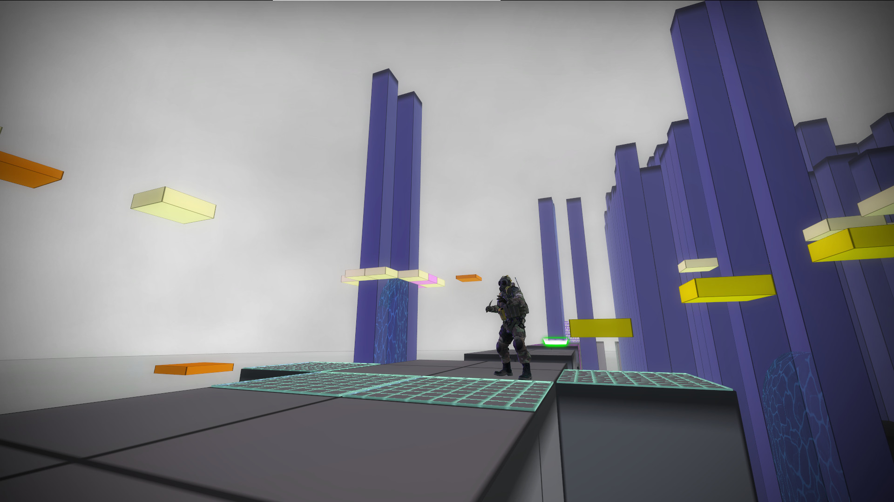
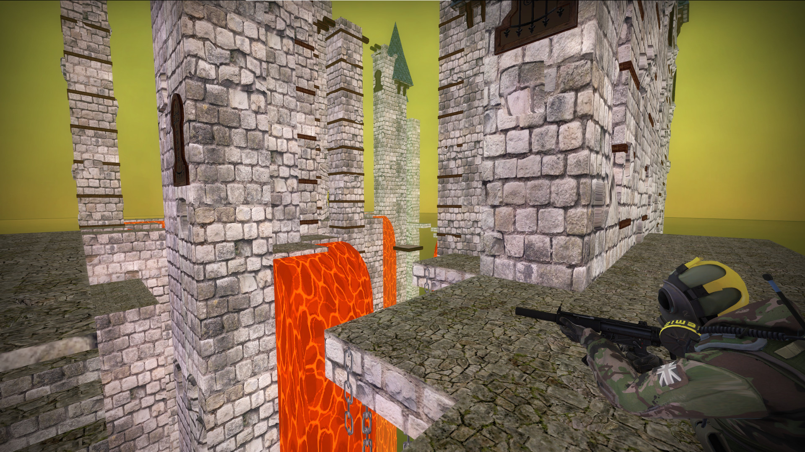
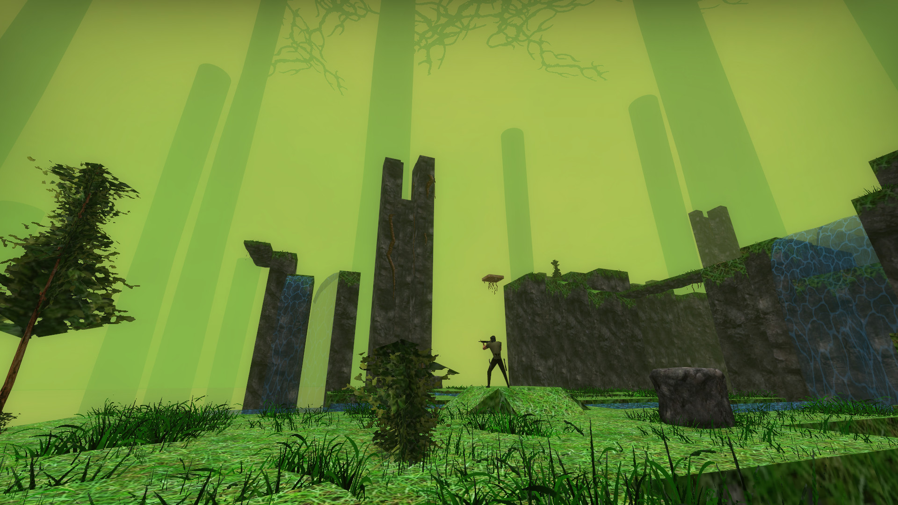
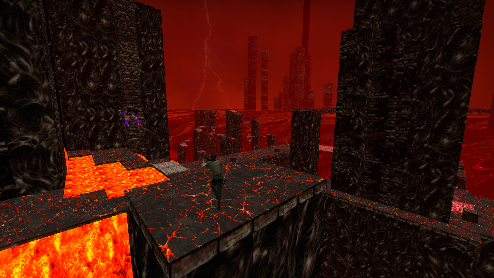
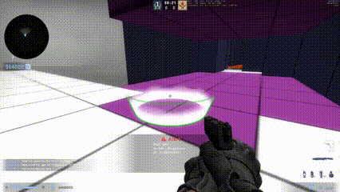
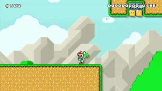
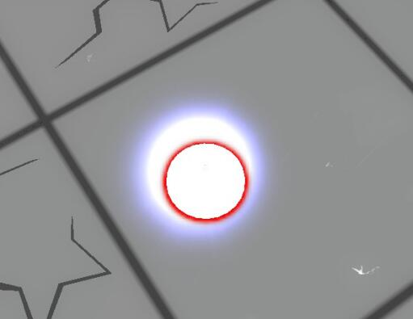
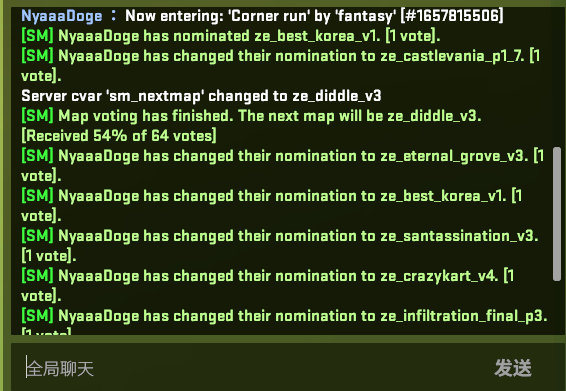

# CS:GO 僵尸逃跑地图 ze_collective 游玩指南 Part.2

Map core by [Luffaren](https://steamcommunity.com/id/LuffarenPer) (STEAM_1:1:22521282)  
This guide by [NyaaaDoge](https://steamcommunity.com/id/NyaaaDoge/) (STEAM_1:1:59449830)

----

- [CS:GO 僵尸逃跑地图 ze\_collective 游玩指南 Part.2](#csgo-僵尸逃跑地图-ze_collective-游玩指南-part2)
  - [6. 关卡主题](#6-关卡主题)
  - [7. 地图事件](#7-地图事件)
    - [7.1 事件刷新机制](#71-事件刷新机制)
    - [7.2 事件列表](#72-事件列表)
  - [8. 地图物品](#8-地图物品)
    - [8.1 人类物品 HUMAN](#81-人类物品-human)
    - [8.2 僵尸物品 ZOMBIE](#82-僵尸物品-zombie)
  - [9. 陷阱地块](#9-陷阱地块)
    - [9.1 Traps spawn](#91-traps-spawn)
    - [9.2 Traps vicinity](#92-traps-vicinity)
    - [9.3 Traps step](#93-traps-step)
  - [10. 一些小彩蛋](#10-一些小彩蛋)
  - [11. 写在最后](#11-写在最后)

----

上一部分我们了解了地图基本的构成，这部分我们来认识一下地图里面的各种内容。

## 6. 关卡主题

ze_collective设置了9种主题。不同的主题会有不同的难度和外貌。体现在关卡装饰物、液体以及墙壁道路等方面。

- generic  
  
原生主题的有害液体（岩浆）触碰后会伴随有持续性的灼烧伤害。
- castle  
  
城堡主题的有害液体（岩浆）触碰后会伴随有持续性的灼烧伤害。  
- factory  
  
- temple  
  
- nature  
  
- hell  
  
地狱主题的有害液体（岩浆）触碰后会伴随有持续性的灼烧伤害。  
- frost  
  
- silenthill  

表世界  
  
里世界，进入里世界主题时会有伴随有警报音，警报音一响起则预示着切换至里世界主题，此时人类触碰有害液体将会变成1hp，同时可视范围也会有所缩短。  

Finale的主题是混乱的，它糅合了所有的主题。
无限关的主题会随关卡的进行而改变。

## 7. 地图事件

在 Finale 中只有贴门炸弹和人类低重力事件不会刷，其他事件均可发生。

### 7.1 事件刷新机制  

通常情况下地图事件只会在生成下一个关卡的时候产生。

一般事件由一个保底的基础概率（通常15%，具体事件刷新概率请查看 [3.2.1 关卡难度](ze_collective%20guide%20pt1.md) 一节。）和累加概率共同决定（通常是5%），如果一个关卡内没有刷事件，则会往概率上累加概率值。  
事件发生之后会有一个 事件CD ，这个 事件CD 值会在0~5之间随机生成，同时每通过一个关卡之后会让事件CD-1直至归零。

举个例子，比如玩家在stage 4，stage 4的事件刷新保底概率是30%，我在开头生成的第一个小关卡没有产生事件，则会往这个概率上面累加10%，从而在生成下一个关卡的时候会有40%的概率随机产生一个事件，事件也有其他因素影响比如关卡的性能开销等。然后如果在下一个关卡没有产生事件，还是继续往这个概率栈里面累加10%，这时再生成下一个关卡产生事件的概率将会变成50%，一直到有事件发生为止。事件发生后，会产生相应的事件CD（stage4为0~3个关卡），在这个事件CD内产生的关卡通常情况下都不会再产生新的事件，并且每通过一个关卡让这个事件CD-1直到其变为0。  
*可以简单理解为现在大部分游戏的抽卡保底机制*

### 7.2 事件列表  

- **PIZZA OF DOOM**  
  
披萨从天而降，开枪或被毁灭。
基本血量500，每个人类增加1000血。  
*[This music gets you so pumped to deliver some PIZZAS.](https://www.youtube.com/watch?v=czTksCF6X8Y)*  
*[THE PIZZA IS AGGRESSIVE](https://youtu.be/LB871SVYMhI?t=49)*  
- **PLEDGE**  
  
我宣誓为collective尽一份力！  
`i pledge to do my part for the collective`  
在聊天框输入这段话即可。未宣誓者将每秒流失2hp直到去世。  
*未宣誓者之死*  
*`NyaaaDoge did not state the pledge`*  
- **KAMIKAZE**  
   
将母体僵尸选为神风飞机的驾驶员以自爆的方式冲向人类，人类需要将其击坠或躲在掩体之后。初始血量250，每一个人类增加50血。
- **BEAMS**  
  
天坠激光会从人类头上坠落。钻空隙躲避，碰到直接秒杀。
- **WORLD EATER**  
  
天上有一张大脸，射爆他，不然他就一直看着你。吞噬世界。如果没打掉，他会一直跟着人类  
大脸初始血量1000，每个人类加500血，每个僵尸加250血
- **THICK FOG**  
  
人类的视野暂时受浓厚迷雾阻碍，持续40s。
- **BLOODLUST**  
渴血事件。人类很饥渴（每次掉2hp），需要射爆僵尸才能回血（每次射击僵尸回3hp），持续60s。
- **DEBRIS**  
  
天上掉下各种地图方块的碎片，每块造成19hp，持续60s
- **LOW GRAV**  
人类获得20s的低重力，20s后直接切换成正常重力，人类要小心最后不要摔死了。
- **COLLAPSE**  
  
之前的关卡在逐渐分崩离析，该关卡内的所有的方块都会坍塌。
- **PHASING**  
  
人类的眼睛进行相位转移，参透世界，地图方块变得透明。持续20s  
*小心行事*
- **SILENCE**  
人类全体静音15s。15s逐渐消失，15s完全静音，10s恢复至正常。
- **WEAPON JAM**  
武器卡壳9s，期间会不停上子弹。
- **WALLBREAK**  
  
触发事件时所有的墙壁格子会逐渐消失，不再恢复。
- **BIGNADES**  
  
人类手雷暂时获得增益40s，期间手雷变成大脸 ~~(和天降大脸一个模型VAUFF)~~ ，每颗雷对僵尸造成5000伤害，手雷伤害范围增大，也会有高击退效果。对Boss也能造成5000伤害，同时会有60%的几率眩晕Boss 5s。
- **DOORHUG BOMB**  
  
贴门炸弹，通常只会在下张地图生成的时候产生该事件，左下角提示出现1.2s后爆炸，贴近伤害很高。聪明的人贴门都会离终点光圈至少2格远以上，就不会受到伤害，如图所示绿色为安全区域，紫色为终点紫圈的格子。  
  
*断后部队不要怕，死的都是贴门的*
- **DISTORT**  
  
人类全体获得扭曲视线，持续15s。  
*我瞎了*

## 8. 地图物品

大部分情况下物品都有使用次数和限制。详细请查看拾取后的说明。物品最多存在30个，如果超过该数量新的关卡不会产生新的物品。  
如果关卡里面没有安排 人类/僵尸 物品生成点，且物品刷新机制认为需要生成神器的时候人类或僵尸物品会在关卡的两个起点色块刷新。  

### 8.1 人类物品 HUMAN

- **猎龙巨剑(`0s`)**  
它太过巨大，以至于难以称之为一把剑……  
在下落时攻击，可以使出劈斩攻击  
使用它会对你的身体造成损伤  
当你的体力太弱 (`5hp`) 时，会无法继续使用它  
血渍积聚附着使其沉重，难以挥舞战斗  
水元素水晶可以洗去巨剑上的血迹  
火元素水晶可以使其暂时增强  

- **法式长棍面包(`0s`)**  
挥舞法棍以阻止僵尸靠近  
每次挥舞都会推开并且伤害僵尸（同时也会损坏自身）法棍最终会因过度受损而断裂  
（每次挥舞命中增加 `0.10%` 的断裂概率）  
（每次挥舞未命中增加 `0.50%` 的断裂概率）  
水元素水晶可以将破裂概率设置为 `-15.00%`  
可以伤害/眩晕Boss  

- **迷你老虎机(`1s`)**  
一个便携老虎机，随时随地可供游玩  
获胜概率：`5.00%`  
失败：减少`7hp`  
获胜：增加`42hp`  

- **比尔·奈(`1x`)**  
向周围的僵尸播放比尔·奈[^Bill_Nye]的录像带[^VHS]  
懒懒散散的人还是继续在课上走神吧  
他们的注意力会被吸引到电视上  
持续`14s`  
可以眩晕Boss  
*[Bill Nye The Science Guy - Theme](https://youtu.be/nDN7M0J3HXc?t=17)*  

[^Bill_Nye]: Bill Nye（全名William Sanford Nye）是一位美国科学家、工程师、教育家和电视名人，被称为“科学家先生”。他在90年代主持的科学教育电视节目[《Bill Nye the Science Guy》](https://zh.wikipedia.org/wiki/%E6%AF%94%E7%88%BE%E6%95%99%E7%A7%91%E5%AD%B8)在美国和其他地区广受欢迎，该节目旨在为年轻观众介绍科学概念和实验。Bill Nye在科学普及和科学教育方面做出了许多贡献，他经常在电视上和公众场合演讲，以鼓励年轻人对科学感兴趣并学习科学知识。

[^VHS]: [家用录像系统](https://zh.wikipedia.org/wiki/%E5%AE%B6%E7%94%A8%E5%BD%95%E5%83%8F%E7%B3%BB%E7%BB%9F) （英语：video home system，简写为VHS），是由日本JVC公司在1976年开发的一种家用录像机录制和播放标准。

- **花生酱(`5s|10x`)**  
涂抹上一层花生酱  
僵尸接触时会大量减速，持续`6s`  
一块花生酱涂抹持续`15s`  
同一块花生酱不能减速同一个僵尸两次  
减速效果可以叠加  
可以在生成时伤害/眩晕Boss  
*[同ze_toaster中的花生酱](https://gamebanana.com/mods/79907)*  

- **阔剑地雷(`10x`)**  
在你的面前部署阔剑地雷  
僵尸靠近阔剑地雷前方会爆炸  
阔剑地雷可以伤害、点燃和阻碍僵尸前进  
可以伤害/眩晕Boss  
火元素水晶可以增加它的伤害  

- **背人椅(1 座位)**  
允许背一个人在你身上(他们必须对鞍座按下E来上/下鞍)  
如果你死亡/丢掉匕首，乘客会被迫离开  
乘客下鞍时会获得一个跳跃/加速度提升  
(可以以此进行一个类似于“耀西二段跳/boost-jump”的跳跃)  
给人带来一段愉快的载人兜风之旅！  
  

- **黑客(`1x`)**  
获得10秒的自瞄+无限弹药  
只需不断射击就能轻松获得一次次的击杀  
附近/瞄准的僵尸成为一击必杀  
附近的僵尸会被透视功能标记  
可以伤害/眩晕Boss  

- **连跳激素(`30.00f`)**  
为自己注射Bhop激素，实现自动连跳！  
有限的剂量导致其有使用限制  
使用 +use/E 来开关  
每次激活使用将消耗`2.00f`  
你可以用它一次越过四个地块远的距离  
*[=) i´m not phoon =)](https://youtu.be/SNvDUO42Hys?t=35)*  

- **星球水晶(`1x`)**  
  1. 土元素水晶  
在你的面前生成一面墙  
3格宽、2格高，持续`12s`  
有人类在墙里面会自动破坏该墙壁格子(防滥用)  
接近主传送点时会被自动破坏  
可以伤害/眩晕boss  

  1. 火元素水晶  
造成大量伤害并点燃僵尸`10s`  
同时轻微减速僵尸`3s`  
火焰会朝你的前方喷射  
当僵尸首次接触火焰时会立即减速  
可以伤害/眩晕Boss  

  1. 风元素水晶  
用一股强风推开僵尸  
这道风会朝你的前方喷射  
持续时间为`2s`  
可以打断僵尸风的投射物  
可以伤害/眩晕Boss  

  1. 水元素水晶  
使僵尸瞬间减速并大幅减速僵尸`10s`  
水会朝你的前方喷射  
它并不会造成伤害，仅有减速效果  
可以伤害/眩晕Boss  

- **空间裂隙(`1x`)**  
创造一个传送门捷径  
第一次使用：创建入口传送门（大）  
第二次使用：创建终点传送门（小）  
传送门会在第一次使用或被僵尸碰触`100s`后消失  
使用它来帮助你的断后部队安全撤退  
不能在断口中间第二次使用来创造出口  

- **风暴之刃(`150s`)**  
使用跨维度的次元斩击来定身和削弱僵尸  
僵尸的生命值降至当前值的`2%`  
它只会在使用的第一时间内定身其附近的僵尸  
当次元斩结束后，僵尸的生命值下降，同时附近的僵尸会被减速`15s`  
可以伤害/眩晕Boss  
*[I AM THE STORM THAT IS APPROACHING](https://youtu.be/NOZONW-UK0w?t=24)*  

- **治愈球(`1x`)**  
产生一个治愈球罩  
每`0.50s`治愈`9hp`(最多至`150hp`)  
治愈球持续`15s`  
提供无限弹药  
提供一颗手雷（仅一次）  
*通常情况下如果奶球不存在会在下一个关卡刷出来，即使用完了拿在身上也会判定为奶球存在*  

- **月球靴(`1s`)**  
施加一个垂直向上的推力  
可以结合跳跃来到达格外高的地方  

- **特殊物品 卡丁车**  
操作方法(仅限鼠标操作)：

  - 向最头顶看可以跳跃
  - 向上看/高于中心高度加速
  - 向下看减速
  - 向侧面看转向[以自身卡丁车为中心旋转]
  - 向最底下看下车

### 8.2 僵尸物品 ZOMBIE

通常情况下僵尸物品都会有一个仅限母体僵尸获取的锁定时间，所以母体僵尸可以有更快拿到物品的权利。这个锁定时间在任意僵尸触碰时就会开始计算。  

- **鱿鱼(`1x`)**  
投出一只鱿鱼，击中地面后会喷墨  
鱿鱼会沿着你正在看的方向扔出  
它也可以在墙上弹射  
喷墨会致盲和减速附近的人类  
被喷墨的人类 (`10s`) 无法使用物品  

- **披萨师(`10s|3x`)**  
在你正在看的方向上生成一块移动的披萨  
接触到的人类会被一击必杀  
披萨能穿过墙  
*[THE PIZZA IS AGGRESSIVE](https://youtu.be/LB871SVYMhI?t=49)*  

- **震荡(`1x`)**  
将人类从你身边大力投掷开  
把他们推下地图边缘  
或者把他们从防守点中抛出来  

- **投弹手(`10s|3x`)**  
扔出一个炸弹，在 `5s` 后爆炸  
炸弹沿着你正在看的方向投出  
造成 AOE/爆炸伤害  

- **咆哮(`1x`)**  
用咆哮将附近的僵尸向前推  
推力会沿着你的看的方向向前推  
出其不意地攻击人类防线！  
它也能治疗你附近的僵尸，使其恢复至 `10000hp`  

- **油滑手指(`1x`)**  
使附近的人类掉落手中的武器（持续`2s`）  
你只有一次机会，善加利用吧  

- **惊吓(`1x`)**  
使用后给予僵尸`1.50s`的无敌状态  
人类的物品/子弹无法对你造成影响  
附近的人也会被恐惧片刻无法行动  
同时还会生成15个向前移动的僵尸幻象  
把握好使用时机，你只有一次机会  

- **飞翔(`1x`)**  
给予翅膀，直至死亡  
你的血量被限制最高为`500hp`  
你感染的人类会被传送回TP起点  
当你太靠近触发当前关卡终点的时候，你也会被传送回TP起点  
通过看向的方向和使用WASD进行飞行  
（你的飞行推动力很慢）  

- **狂风(`10s|5x`)**  
在你正在看的方向上生成一股狂风  
狂风将人类推开  
它能穿过墙壁  

- **鞭钩(`10s|5x`)**  
在你正在看的方向上生成一条又长又细的引力鞭子  
光束会用一股力量将触碰到的人类拉向你  
它会在`2s`后产生拉人的力量  
它会在拉到人时造成`21`点伤害  
*“给我过来！” 是真人快打系列里面 蝎子 丢出苦无击中对手后的的一句经典的标志性台词 "[Get Over Here!](https://youtu.be/kwBhReFJkr8?t=33)"*

- **石头(`3s|10x`)**  
扔出一块石头对人类造成伤害  
石头会朝你正在看的方向抛出  
触碰人类造成 `29` 点伤害  

- **伪装者(`1x`)**  
伪装成人类形态，持续 `15s`  
使用时你会随机传送到一个人类身边（并获得 `5s` 的无敌时间）  
变身成人的状态下无法感染人类  
（但是人类可以对你造成伤害）  
变身状态结束后，你可以感染人类（感染的人类会被传送回到出生点）  
你的hp会动态限制，直到你死去  
*[When the imposter is sus!](https://www.youtube.com/watch?v=0bZ0hkiIKt0) ☜ඞ*  

- **破坏锤(`3s|5x`)**  
破坏你面前的地图方块（复数）  
（半径较小，需要精确使用）  
摧毁附近的人类物品  
对人类造成轻微的范围伤害  
打破的地图方块会在 `7s` 后变红并掉落  
僵尸跳过被破坏的区域会受到大量的减速效果`10s`（在方块掉落后 `7s` 会消失）  
在结局关的开始阶段不可用  

- **空间裂隙(`1x`)**  
创造一个传送门捷径  
第一次使用：创建终点传送门（小）  
第二次使用：创建入口传送门（大）  
传送门会在第一次使用后的 100s 后消失  
用它来帮助你的僵尸队友前进  
不能在断口中间使用第一次来创造出口  
当入口靠近主传送点时入口传送门将被锁定  

## 9. 陷阱地块

  
陷阱地块通常有三种类型，如果在下落到虚空的途中受到了陷阱的影响，可能会导致直接去世。  

1. Traps spawn
2. Traps vicinity
3. Traps step

### 9.1 Traps spawn

这个地块会生成以下陷阱

- **kart**  
  
陷阱卡丁车，人类和僵尸都能进入。僵尸进入会触发圣战模式，碰到人就自爆。  
*[Crazykart](https://www.youtube.com/watch?v=MaRH43xdgSo)*  
操作方法(仅限鼠标操作)：
  - 向最头顶看可以跳跃
  - 向上看/高于中心高度加速
  - 向下看减速
  - 向侧面看转向[以自身卡丁车为中心旋转]
  - 向最底下看下车
- **thigh spider**  
  
小腿腿NPC活蹦乱跳，粘在人类身上每咬一下造成3hp伤害
初始血量300，每个人类增加100血
- **button mimic**  
  
红色的拟态按钮，谁按谁上当
- **explosive barrel**  
  
炸药桶，射击1到30次之间会爆炸。
- **slot machine**  

老虎机，10%几率获胜获得150hp，每次输扣18hp。
使用次数在1到20次之间会爆炸，有40%的几率产生小老虎机神器。
- **mimic**  
  
拟态神器，只要不去触碰就不会触发陷阱，碰到就原地去世  
*Tips: v1_9 之后你可以用 E-Pick 的方法检验神器的真伪，但是E-Pick仅限首次拾取神器有防 E-Pick 滥用机制，二手神器就没有这个保护机制了*  

### 9.2 Traps vicinity

这个地块会产生以下的范围型陷阱  

- **bomb**  
  
8秒倒计时的炸弹。*Back! get back!*  
- **guster**  
  
效果和ZM风一样，会把人吹开
- **flinger**  
  
效果和ZM震荡一样，会把人震开
- **black hole**  
  
生成一个黑洞，有强大的引力吸引人类，人类碰到其中心会去世，吸引一段时间后会消失

### 9.3 Traps step

这个地块会产生以下陷阱，只有玩家踩到该地块上才会触发

- **trap floor**  
  
踩上去地板会消失，特征是地块上面有裂痕
- **landmine**  
  
*有地雷！小心脚下！*
- **bear trap**  
  
捕人器，人类踩上去-69hp顺带无法行动10s
- **pizza**  
  
*[THE PIZZA IS AGGRESSIVE](https://youtu.be/LB871SVYMhI?t=49)*  
别管是什么陷阱了，不知道看不懂的东西别乱碰？？？不知道看不懂的东西别乱碰？？？不知道看不懂的东西别乱碰？？？
- **chatter curse**  
  
地上会生成一个隐约可见的狮子头，人类踩一踩触发聊天扣字诅咒。每次损失2hp。
想解开诅咒需要在聊天框中输入屏幕显示的那段话。下面是所有可能的语句。
  - "i just farted really loud lol"
  - "wtf my teeth are so yellow"
  - "its not gay to take it up the ass"
  - "fuck my tight little hot pot pussy"
  - "my gf became pregnant yesterday"
  - "cant wait to suck off my bf later"
  - "ima ask mom to make me dino nuggies"
  - "subscribe to luffaren on patreon"
  - "my fingers are so fucking greasy"
  - "fucking poop ass balls tits fuck shit"
  - "ugh i feel so horny right now"
  - "my lips are meant for sucking"
  - "add me on steam for feet pics"
  - "my bf came in me last night what do i do"
  - "i always dreamt of becoming a cuck"
  - "googo gaga waah waah baby want milkies"
  - "i get really turned on by you"
  - "licking your own ass is hard af lol"
  - "i drink starbucks every single day"
  - "this map is the best map of all maps"
  - "my tits are starting to sag"
  - "my dick is actually really small tbh"
  - "my muscles are super big and cool i swear"
  - "guys steroids arent bad right"
  - "im high as fuck"
  - "i tried eating dog and its actually pretty good"
  - "brb my boyfriend is calling me"
  - "i think domestic violence should be legal"
  - "my ass is grass and i want u to smoke it"
  - "fuck i just realized i smell really bad atm"
  - "in full honesty cum doesnt actually taste that bad"
  - "let it be known that im gay"
  - "i wish that someone would peg me"
  - "i dare an admin to kick me"
  - "yo are any girls on the server rn"
  - "hey any girls here add me haha"
  - "fuck this ima pump my dick to xvideos"
  - "i wish this map had lasers"
  - "i deadlift 35kg im getting there"
  - "how do i get rid of itchy dick"
  - "giv eme your item plz"
  - "fuck my tight little zombie pussy"
  - "fuck yuor dont fall back bitchs"
  - "abcdefghijklmnopqrstuvwxyz"
  - "how do i use items"
  - "admin slay me you wont pussy"
  - "admin please slap me"
  - "do me harder oh yeah ah ooh"
  - "guys i cant hold it in anymore"
  - "i can lead this map better than you"
  - "anyone wanna play fortnite with me"
  - "im high as fuck"
  - "god i wish i could get laid"
  - "how do i get girl to touch my peepe"
  - "i pledge to do my part for the collective"
  - "i want luffaren to take my virginity"
  - "these zombie models make me horny"
  - "i did not cum on my cat"
- **spikes**  
  
各种游戏里面必不可少的经典款尖刺。  
以150速度水平触碰会-23hp  
以50速度垂直触碰会-132hp  
- **banana**  
  
可爱的香蕉皮，但是你踩上去自己转个五圈

## 10. 一些小彩蛋

你可能会在游玩地图的过程中看到这些Luff埋藏的小彩蛋

- 地图预定恶搞事件  
  
你可能会看到左下角时不时出现 某某玩家预定/投票了某个地图 [1 vote]。
以下是可能会看到的地图列表  
  - ze_blackmesa_lambda_v1
  - ze_infiltration_final_p3
  - ze_predator_ultimate_p7
  - ze_toaster_p3
  - ze_halo_poa_p4
  - ze_interception_p2
  - ze_frostdrake_tower_v1
  - ze_castlevania_p1_7
  - ze_santassination_v3
  - ze_diddle_v3
  - ze_pizzatime_v9
  - ze_best_korea_v1
  - ze_magmadrake_b4
  - ze_eternal_grove_v3
  - ze_crazykart_v4
  - ze_collective_v1_9

- Steam/Discord 音效恶搞  
你可能会在游玩过程中听到自己Steam/Discord被敲打等音效，但是你跑出去看并没有被敲打！  
最少需要5位玩家才能触发这个小彩蛋  
*你上当了！只是一个音效播放恶作剧*

- 神器Combo  
按照 `土-火-风-水` 的顺序依次使用元素水晶，会召唤一个地球超人。需要注意的是这个超人的位置是按照土开始释放的位置来确定的，这个combo的间隔是7s。超人也会攻击Boss。  
*[Captian Planet](https://www.youtube.com/watch?v=OiYjTb3opAA), he's a hero.  
Gonna take pollution down to zero...*  

- 特定关卡事件  
ze_collective为一些特殊的小关卡（pixel-stage）设置了一些特别的事件，这些事件通常情况下是独立存在的，不会与地图事件产生冲突。  
  1. ——一款被称为 **“史上最难迷宫”** 的经典Flash小游戏，进去之后看地图非常非常简单，实际上他也确实是非常非常简单，他的目的就是为了骗你玩这款《吓人迷宫》。在玩家专心走迷宫的时候，会突然出现一张吓人的鬼脸。主打的就是一个互联网的恶趣味“跳跃式惊吓”。在collective里面你也有机会遇到这样的恶搞地图哟（悲。  
  *多么好看的迷宫啊！  
  我们过去吧  
  HOLY SHIT！！！*  
  [*胆小慎入*](https://youtu.be/0WjDrQ0IhBw)  
    
  1. ——我的美腿。字如其名，白丝美腿，prprpr。这个关卡事件会触发对应的热水器文本，同时会在关卡内生成10只小腿腿NPC[^thigs_npcs]。  
  > Oh my god these thighs  
  I wish to dive deep into them  
  Let me explore them  
  Deeper  
  Deeper...  
  Lord forgive me for what i'm about to do to Shellbert  

[^thigs_npcs]: 此处感谢卤粉高玩海鲜西的纠错。

## 11. 写在最后

本指南只介绍了ze_collective中基本的组成部分。如果你想发挥你的想象力为ze_collective出一份力，去看看Luff给的绘画工具吧！笔者写这篇指南的动机是觉得ze_collective这张地图非常有意思，既可以在ze玩到肉鸽like模式，也能用自己的想法简单实现一个关卡，甚至是快速实现部分小关卡的地图原型，难道不觉得很酷吗？这张地图的内核和玩法真的很有意思！即使刨除掉神器部分，其他的要素玩起来也是相当有意思！
